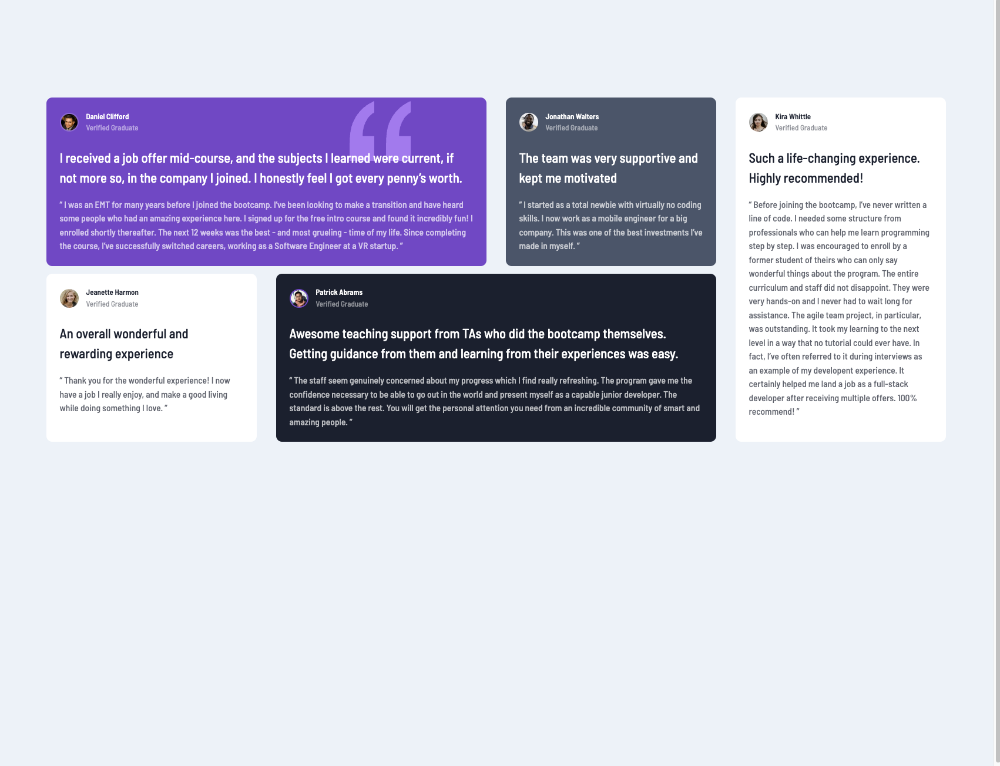

# Frontend Mentor - Testimonials grid section solution

This is a solution to the [Testimonials grid section challenge on Frontend Mentor](https://www.frontendmentor.io/challenges/testimonials-grid-section-Nnw6J7Un7). Frontend Mentor challenges help you improve your coding skills by building realistic projects.

## Table of contents

- [Overview](#overview)
  - [The challenge](#the-challenge)
  - [Screenshot](#screenshot)
  - [Links](#links)
- [My process](#my-process)
  - [Built with](#built-with)
  - [What I learned](#what-i-learned)
  - [Continued development](#continued-development)
  - [Useful resources](#useful-resources)
- [Author](#author)

## Overview

### The challenge

Users should be able to:

- View the optimal layout for the site depending on their device's screen size

### Screenshot

### Links

- Solution URL: [Github repo](https://github.com/mrcordova/tertimonials-grid-section)
- Live Site URL: [Github page](https://mrcordova.github.io/tertimonials-grid-section/)

## My process

### Built with

- Semantic HTML5 markup
- CSS custom properties
- Flexbox
- CSS Grid
- Mobile-first workflow

### What I learned

I learned how to use Grid and background images.

### Continued development

I will continue to learn about css grid and how to make more responsive layouts.

### Useful resources

- [How to place background image](https://developer.mozilla.org/en-US/docs/Web/CSS/background-attachment) - This helped me for placing a background image.

## Author

- Website - [mrcordova](https://github.com/mrcordova/tertimonials-grid-section)
- Frontend Mentor - [@mrcordova](https://www.frontendmentor.io/profile/mrcordova)
